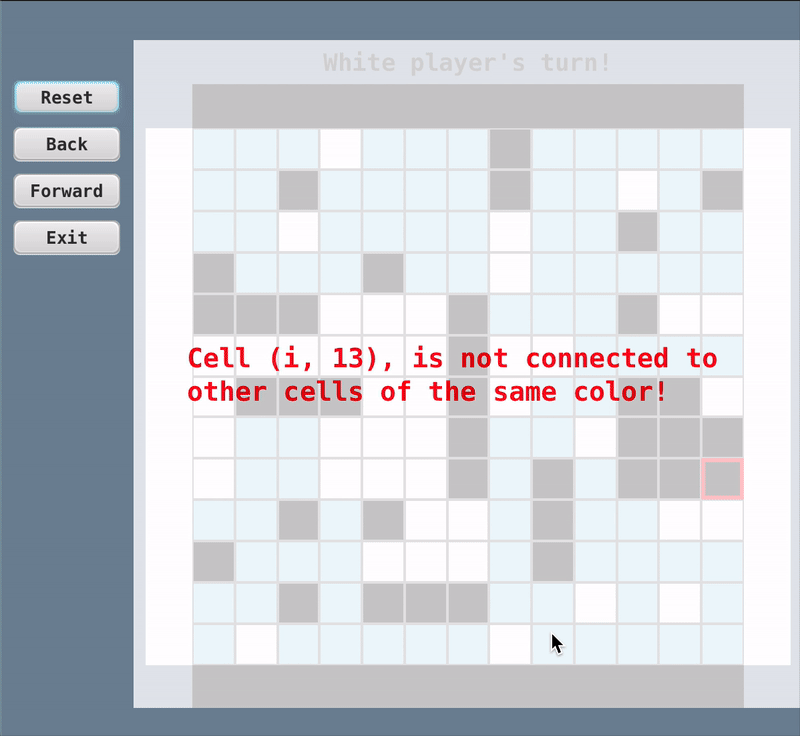

# **Quentin**

[](https://github.com/Gabriele-tomai00/Quentin-game/actions/workflows/gradle.yml)
[](https://github.com/Gabriele-tomai00/Quentin-game/actions/workflows/qodana_code_quality.yml)

Quentin is a drawless connection game for two players: Black and White. It's played on the intersections (points) of a square board, which is initially empty. The top and bottom edges of the board are colored black; the left and right edges are colored white. Luis Bolaños Mures designed Quentin in April, 2012.

---

## **Features**
- Play as either Black or White.
- Simple rules with deep strategic gameplay.
- Designed to run on any platform with Java.

---


## **Instructions**
For detailed instructions on how to play Quentin, refer to the [Instructions File](Quentin.pdf).

---

## **Installation**

### **Prerequisites**
1. Ensure you have [Java 17 or higher](https://adoptopenjdk.net/) installed.
2. Install [Gradle](https://gradle.org/install/) or use the Gradle wrapper provided in the project.

### **Steps**
1. Clone the repository:
   ```bash
   git clone https://github.com/Gabriele-tomai00/Quentin-game
   cd Quentin-game
   ```

2. Build the project:
   ```bash
   ./gradlew build
   ```
If you already have Gradle installed you might need to run `gradle wrapper` before build.

---

## **Execution**

Run the application using Gradle: `./gradlew run`  
But for a better visualization I suggest you a different version with an "easy" output:
   ```bash
./gradlew run --console=plain
   ```

### Help

To view help menus simply type `help` and press return. To exit use `exit`.  
You can choose between 3 game modes:
- **GUI mode:** with `startgui` or `sg`
- **Online mode:** with `startonlinegame` or `og`
- **Local mode:** with `startlocalgame` or `lg`

once a mode has been chosen the program will prompt for further configuration or the game will simply start.
You can use the `help` command also during a match, to understand how to play.
---

## **Uninstalling**

To uninstall Quentin, simply delete the cloned repository:
```bash
rm -rf quentin
```
